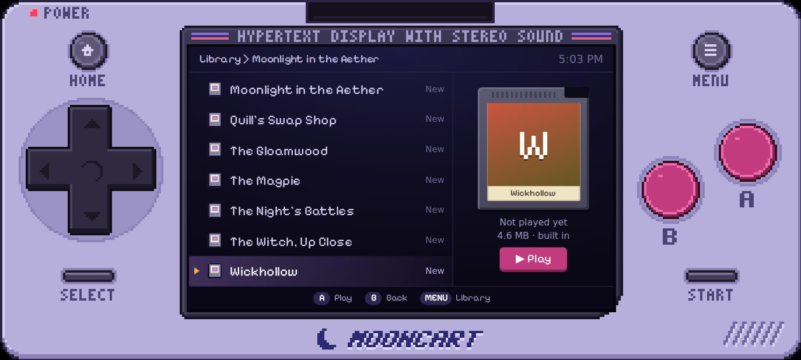
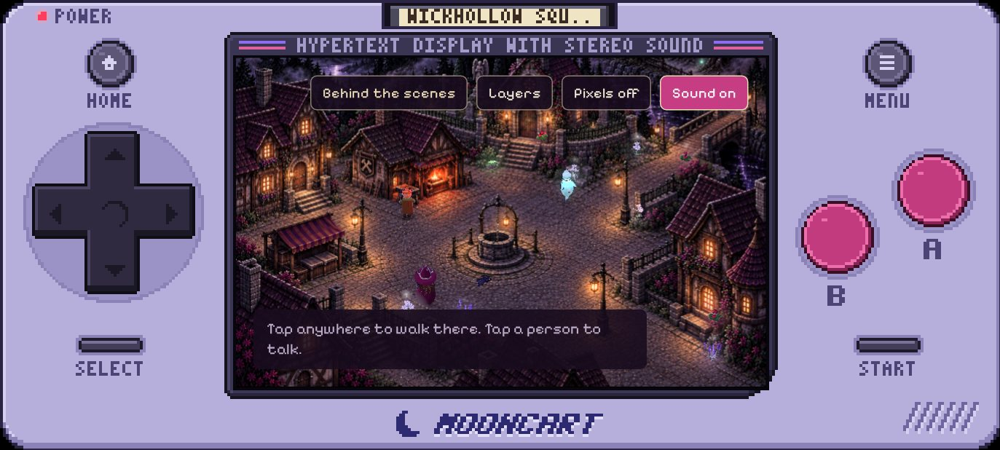
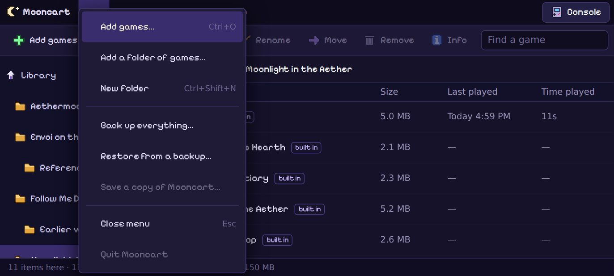

<p align="center"></p>

# Mooncart

A retro handheld console for Android phones that plays single-file HTML games. Your games are
already inside it, and you can add more. It never uses the internet, so a cheap Android phone in
airplane mode can keep playing them for as long as the phone works. The same console also runs
on a laptop, as one file you open in a web browser.





## Put it on a phone

1. On the Android phone, open **[the Releases page](https://github.com/chriskizer91-ops/building-with-assets-/releases/latest)**.
2. Tap **Mooncart-….apk** to download it (about 40 MB; about 100 MB once the two private games are built in, see below).
3. Open the download. Android asks whether your browser may install apps: allow it, then tap **Install**.
4. Open **Mooncart**. From now on you can turn on airplane mode.

It runs on Android 7.0 or newer. A $50 phone is fine. Very large games (the 35 MB Witch Way
version) take a few seconds to start on a slow phone.

To add your own games on the phone: **MENU › File › Add games…**. To take out a built-in game you
don't want: pick it in the library, then **Edit › Remove…**.

## On a laptop

1. From **[the Releases page](https://github.com/chriskizer91-ops/building-with-assets-/releases/latest)**,
   download **Mooncart.html** (about half a megabyte).
2. Open it. It opens in your web browser; Chrome or Edge work best.
3. Add your games: **MENU › File › Add games…** (or *Add a folder of games…*).

It's the same console, with two small sample games in it (Starfall and Button Check). The games you
add and their saved progress stay in that browser on that laptop, and it needs no internet. Keep
your game files too: clearing the browser's data, or opening Mooncart.html in a different browser,
starts it empty again. Backups and *Save a copy of Mooncart* are only in the phone app.

## Playing

| | |
|---|---|
| **D-pad, A, B** | Pick a game, A to play it. Tap a game, then tap it again (or **▶ Play**). |
| **In a game** | The console's buttons press keys: d-pad = arrow keys, A = Enter, B = Escape, START = M, SELECT = H. Games made for phones also work by tapping the screen. |
| **HOME** or the phone's **Back** button | The game menu: keep playing, restart, hide the console so the game fills the screen, open the library, or quit to the game list. |
| **MENU** | The library (below). |
| **Controller** | A Bluetooth or USB game controller works like the console's buttons. |

Each game can have its own buttons: in the library, pick the game and choose **Game › Properties…**.

What the Map Forgot draws its own handheld, so it starts with Mooncart's console hidden. Use
the game menu's **Show the console for this game** if you'd rather see both.

## The library (MENU)



The library works like the files on a computer, with menus at the top:

- **File**: *Add games…* (from Downloads, a memory card or a USB stick), *Add a folder of games…*, *New folder*,
  *Back up everything…*, *Restore from a backup…*, *Save a copy of Mooncart…*
- **Edit**: *Rename…*, *Move to…*, *Remove…*, *Select all*
- **Game**: *Play*, *Properties…*, *Replace with a newer file…*, *Make it work offline*, *Export saves…*, *Import saves…*, *Delete saved data…*
- **View**: list or cartridges, sort order, the console's colour (seven to pick from), screen shape, which way you hold the phone, *Settings…*
- **Help**: how to use it, buttons and keys, keeping your games for years

Long-press a game for the same actions. You can also add a game from the phone's Files app: tap
an `.html` file and choose **Open with Mooncart**.

**Saves.** Every game keeps its saved progress the same way it does in a web browser, in its own
slot named after its title. A newer version of a game with the same title picks up the same save.

## Keeping it working for 20 years

- **Mooncart never needs the internet.** The console, its fonts and every built-in game are inside the app.
  Games that loaded parts from the internet (the Envoi demos used a 3D library and fonts from the web)
  had those parts packed into them when the app was built.
- **Keep the installer.** In the library, **File › Save a copy of Mooncart…** writes the `.apk` to a memory card
  or Downloads. It reinstalls Mooncart on this phone or another Android phone, with no internet.
- **Back up your saves.** **File › Back up everything…** makes one `.zip` with your added games, folders,
  cartridge pictures and saved progress. On another phone: install Mooncart, then **File › Restore from a backup…**.
- **Freeze the phone.** In airplane mode nothing on the phone changes. If you go online now and then,
  turn off automatic updates in the Play Store so the phone's web engine (Android System WebView) stays as it is.
  (Updates almost never break a game, but this way nothing changes at all.)
- **Before going offline for good**, connect once and update *Android System WebView* (or Chrome) in the
  Play Store, so the phone has a recent web engine to run the 3D games.

## The games inside

The built-in games are listed in [`games.json`](games.json): What the Map Forgot, Follow Me Down Witch Way
(the latest build plus two earlier versions), the eleven Moonlight in the Aether demos, the Aethermoor map and
character ledger, and the Envoi on the Longest Night model pages and reference demos. 31 games, about 150 MB.

**Games from private repositories.** What the Map Forgot and Follow Me Down Witch Way live in private
repositories, and this one is public. The build can only include them if it has a key that can read them,
and it will never put an app with private games inside on a public Releases page. To include them:

1. Make this repository private (**Settings › General › Danger Zone › Change visibility**), so its Releases page is private too.
2. Make a key: your GitHub picture › **Settings › Developer settings › Personal access tokens › Fine-grained tokens ›
   Generate new token**. Repository access: *Only select repositories*, pick the game repositories. Permissions:
   *Contents: Read-only*. Copy the token.
3. In this repository: **Settings › Secrets and variables › Actions › New repository secret**, name it `GAMES_TOKEN`,
   paste the token.
4. **Actions › Build the Mooncart app › Run workflow.** The new `.apk` on the Releases page has all the games.

Until then the app has the games from the public repositories, and you can add the other two on the phone
with **File › Add games…**.

When a game changes, run the build again: on GitHub open **Actions › Build the Mooncart app › Run workflow**.
It fetches every game repository fresh, builds the ones that need building, packs them in, makes the app,
plays some of the games on an Android emulator, and puts the new `.apk` on the Releases page. Installing it
over the old one keeps your saves.

## For developers

```
web/            the console: plain HTML, CSS and JavaScript modules, no build step
android/        the Android app (Java, no libraries) and build.sh (aapt2, javac, d8, apksigner; no Gradle)
games.json      which games go inside
samples/        the two small sample games of the browser version
tools/          collect-games.mjs  gather and pack the games into build/collection/
                dev-server.mjs     run the console in a desktop browser, standing in for the phone
                smoke.mjs          play through it in Chromium and check it (Playwright)
                build-demo.mjs     the browser version: the demo page, or Mooncart.html (--standalone)
                web-smoke.mjs      check the browser version in Chromium
                phone-test.sh      install on an emulator or phone with adb and play some games
                make-icons.mjs     draw the app icon
```

Run it on a computer:

```
node tools/collect-games.mjs --local ..      # games from checkouts next to this one (or no flag: clone from GitHub)
node tools/dev-server.mjs                    # then open http://localhost:8090
node tools/smoke.mjs                         # with the server running
npm install && node tools/web-smoke.mjs      # the browser version
bash android/build.sh                        # needs the Android SDK (platform 35)
```

How it fits together, and the decisions behind it, are in [`docs/how-it-works.md`](docs/how-it-works.md).

Fonts: Pixelify Sans and Jacquard 12 (SIL Open Font License, `web/fonts/OFL.txt`), copied from
`20-min/art/fonts/`.
